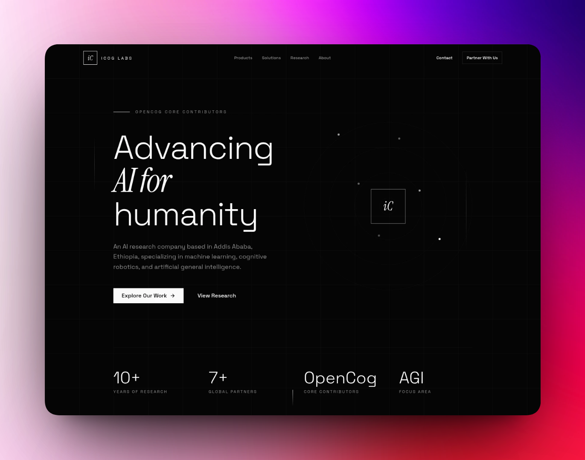
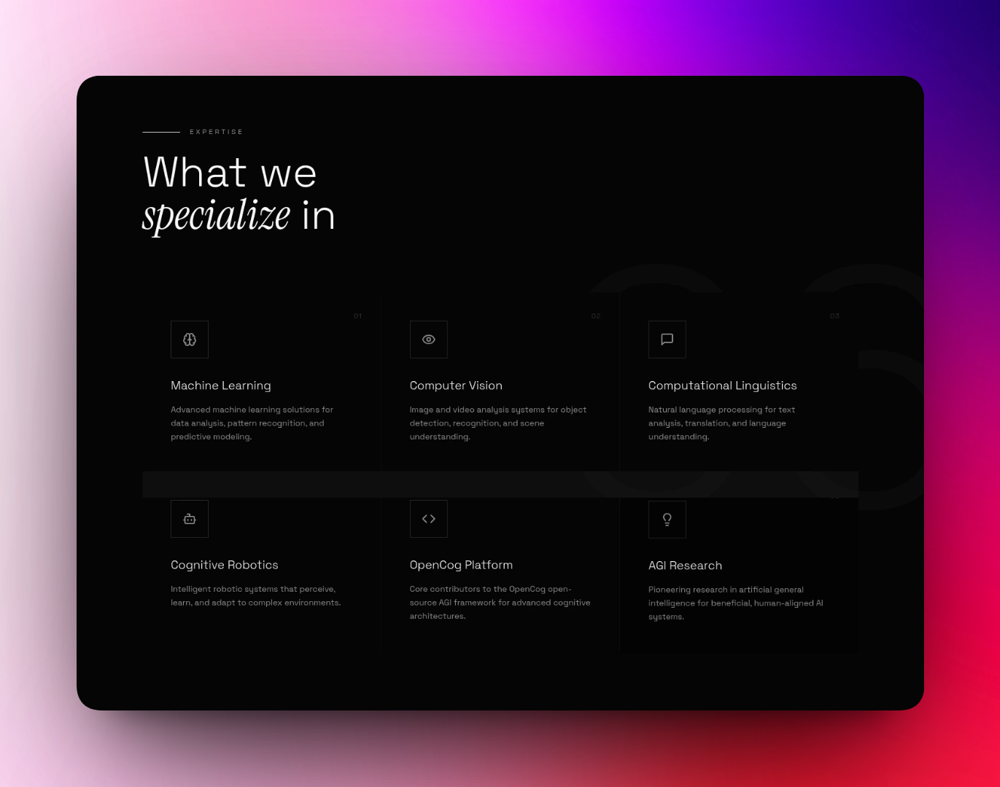
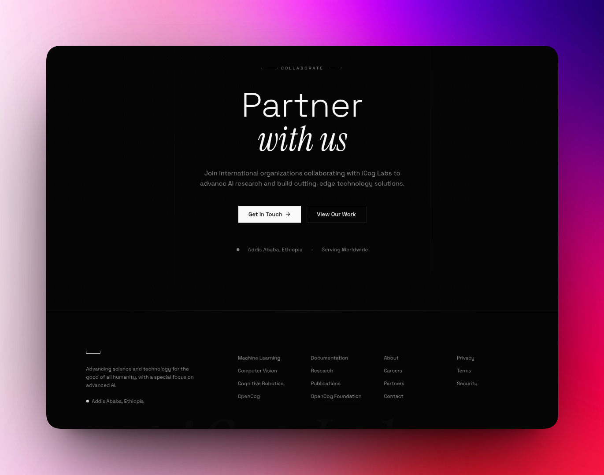

# ICOG Landing Page (Modern Redesign Concept for iCog Labs)

A clean, modern single-page landing site built with **React**, **TypeScript**, **Tailwind CSS**, and **Vite**.

### Why this project?
iCog Labs[](https://icog-labs.com) and iCog[](https://icogacc.com) do amazing AI + education work in Ethiopia, but their sites feel a bit outdated.  
I created this as a practice project / concept to show a fresh, fast, responsive version.  
Hoping it could inspire or even be useful for them!

### Live Demo
👉 https://icog.vercel.app

### Tech Stack
- React + TypeScript
- Tailwind CSS (for styling)
- Vite (fast dev/build)
- Deployed on Vercel

### How to Run Locally
```bash
git clone https://github.com/Henok-Tekeba/Icog.git
cd Icog
npm install
npm run dev

### Preview

### Desktop View


### Key Sections

**Hero Section**  


**Features**  


**Footer**  

